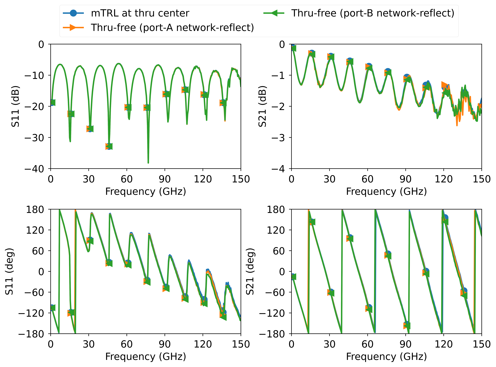

# Thru-free Multiline Calibration

This repository contains code for a method to perform [multiline TRL](https://github.com/ZiadHatab/multiline-trl-calibration) calibration without needing to use a thru standard to define the location of the calibration plane. Hence the name "thru-free". To be clear, this is not the LRL method, in which the thru standard is replaced with a line. The standards used here to replace the thru standard are more involved, as seen in the picture below. For derivation and technical details, please refer to [1].

## Basic principle

The general idea behind multiline TRL calibration is that you have multiple lines of different lengths, a Reflect standard, and a Thru standard. The thru standard can be a line, but generally, after finishing the calibration, the reference plane will be located at the center of the line/thru standard. If you need it to be somewhere else, you need to shift the plane in post-processing with the help of the extracted propagation constant.

The goal of the work presented in [1] is to replace the thru standard with other standards. To accomplish a thru-free calibration, you basically need the following standards:

1. Multiple lines (N≥2). *The same ones used in (multiline) TRL.*
2. A two-port symmetric reflect standard. *The same one used in (multiline) TRL.*
3. An arbitrary two-port network standard, provided it is transmissive, i.e., |S21|, |S12| > 0.
4. A one-port cascade of the aforementioned network standard and reflect standard. This can be at either port.

Below, you can see an illustration of the relevant standards for the thru-free method. Lines are not shown, since the same math is used for both multiline TRL and the thru-free method. For the mathematical details on how the thru-free method uses the measurement of the standards below, please refer to [1].


*Illustration of the standards for the thru-free multiline calibration.*

## Code requirements

The [`multiline.py`][multilinepy] or [`uncMultiline.py`][uncMultilinepy] scripts must be in the same folder as your main script and imported. The difference between the two scripts is that [`multiline.py`][multilinepy] is a pure NumPy implementation, whereas [`uncMultiline.py`][uncMultilinepy] uses in addition the [`metas_unclib`][metas] package to support uncertainty propagation.

To use [`multiline.py`][multilinepy], you will also need to have [`numpy`][numpy] and [`scikit-rf`][skrf] installed in your Python environment. To install these packages, run the following command:

```
python -m pip install numpy scikit-rf -U
```

For [`uncMultiline.py`][uncMultilinepy], you additionally need to install [`metas_unclib`][metas]:

```
python -m pip install metas_unclib -U
```

Regarding the dependencies for the example files, simply refer to the header of the files themselves.

## Sample code

Below is an illustration code on how to use the script. If you don't provide the variables `network` and `network_reflect_A` or `network_reflect_B`, then the code defaults to [multiline TRL](https://github.com/ZiadHatab/multiline-trl-calibration).

```python
import skrf as rf
from multiline import multiline # my code

# Measured calibration standards
L1     = rf.Network('measured_line_1.s2p')
L2     = rf.Network('measured_line_2.s2p')
L3     = rf.Network('measured_line_3.s2p')
L4     = rf.Network('measured_line_4.s2p')
SHORT  = rf.Network('measured_short.s2p')
NETW   = rf.Network('measured_network.s2p')
NSHORT_A = rf.Network('measured_network_short_A.s2p').s11 # from port A
NSHORT_B = rf.Network('measured_network_short_B.s2p').s22 # from port B

lines = [L1, L2, L3, L4]
line_lengths = [0, 1e-3, 3e-3, 5e-3]  # in units of meters
reflect = SHORT
reflect_est = -1
reflect_offset = 0
ereff_est = 2.5-0.00001j

# define the calibration
cal = multiline(lines=lines, line_lengths=line_lengths, reflect=reflect, 
               reflect_est=reflect_est, reflect_offset=reflect_offset, 
               ereff_est=ereff_est, network=NETW, 
               network_reflect_A=NSHORT_A,
               # network_reflect_B=NSHORT_B # optional, but can be used with or in place of network_reflect_A
               )
cal.run_multiline()

dut = rf.Network('measured_dut.s2p')
cal_dut, _ = cal.apply_cal(dut) # apply cal to a dut
```

## Example

In the [`Measurements`][Measurements] folder, you will find measurements of a multiline kit based on microstrip standards. Multiple sweeps were conducted, so they are zipped. The SCPI code used to collect the measurements can be found in my other repository: <https://github.com/ZiadHatab/scpi-anritsu-vectorstar>

The results from [`example.py`][examplepy] are provided below. To see the results with uncertainty, refer to [1], or run the script [`example_with_unc.py`][example_with_uncpy].


*S11 and S21 of calibrated DUT (30 ohm stepped-impedance). The thru standard used in multiline TRL has a length of zero.*


*S11 and S21 of calibrated DUT (30 ohm stepped-impedance). The line standard used as a reference in multiline TRL has a length of 6.5mm.*

## Crediting

If you found yourself using the method presented here in a publication, please consider citing [1]. If you want to use the measurement data, please cite [2].

## References

[1] Z. Hatab, M. E. Gadringer, and W. Bösch, "A Thru-free Multiline Calibration," in _IEEE Transactions on Instrumentation and Measurement_, vol. 72, pp. 1-9, 2023, doi: [10.1109/TIM.2023.3308226](https://doi.org/10.1109/TIM.2023.3308226).

[2] Z. Hatab, "A Thru-free Multiline Calibration: Dataset and Code". Graz University of Technology, May 08, 2023. doi: [10.3217/mgd4n-gq267](https://doi.org/10.3217/mgd4n-gq267)

## License

The code in this repository is licensed under the BSD-3-Clause license. If you want to use the version with uncertainty propagation, you also need to install the METAS UncLib package, which has its own separate license. You can find more information about the package at <https://www.metas.ch/metas/en/home/fabe/hochfrequenz/unclib.html>


[multilinepy]: https://github.com/ZiadHatab/thru-free-multiline-calibration/blob/main/multiline.py
[uncMultilinepy]: https://github.com/ZiadHatab/thru-free-multiline-calibration/blob/main/uncMultiline.py
[examplepy]: https://github.com/ZiadHatab/thru-free-multiline-calibration/blob/main/example.py
[example_with_uncpy]: https://github.com/ZiadHatab/thru-free-multiline-calibration/blob/main/example_with_unc.py
[Measurements]: https://github.com/ZiadHatab/thru-free-multiline-calibration/blob/main/Measurements/

[numpy]: https://github.com/numpy/numpy
[skrf]: https://github.com/scikit-rf/scikit-rf
[matplot]: https://github.com/matplotlib/matplotlib
[metas]: https://github.com/wollmich/metas-unclib-python-wrapper